# **Roteiro 1 - Deploy de Django em Nuvem Bare-Metal**

## **Objetivo**
O objetivo deste roteiro é aprender a configurar e gerenciar uma aplicação Django rodando em infraestrutura bare-metal utilizando o **MaaS (Metal as a Service)**. O roteiro aborda desde a instalação manual do banco de dados e da aplicação Django até a automação do deploy utilizando o Ansible e a configuração de um **proxy reverso** para balanceamento de carga.

---
## Criação da Infraestrutura (Nuvem Bare-metal)

Nesta etapa inicial do projeto, foi realizada a criação da infraestrutura da nuvem bare-metal utilizando o MAAS (Metal as a Service). Todo o ambiente foi montado em servidores físicos (NUCs), com o objetivo de realizar o provisionamento automático das máquinas através de um servidor principal chamado `main`.

O processo iniciou com a instalação do Ubuntu Server 22.04 LTS no `main`, onde foram realizadas as configurações básicas de rede, hostname e DNS. Após isso, foi instalado o MAAS versão 3.5.3, responsável pelo gerenciamento dos recursos físicos da nuvem. Com o MAAS instalado e configurado, foi possível acessar o dashboard web da ferramenta e realizar a importação das imagens do Ubuntu que seriam utilizadas posteriormente no deploy das máquinas.

Além disso, foi feita a configuração do DHCP e DNS através do próprio MAAS, desabilitando o DHCP do roteador do kit e garantindo que o MAAS tivesse controle total sobre a atribuição de IPs das máquinas. Também foram cadastrados e comissionados os servidores `server1` até `server5`, configurando o Power Type como Intel AMT e realizando o boot via PXE. 

Por fim, foi criada uma bridge OVS (`br-ex`) nas máquinas, com o objetivo de facilitar a comunicação entre as VMs e os serviços de rede, e foi realizado o acesso remoto ao ambiente através de NAT, possibilitando o gerenciamento do kit a partir de redes externas como o Wi-Fi do Insper.


## **Tarefa 1 - Banco de Dados PostgreSQL**

- Implantação do **Ubuntu 22.04** no `server1` via MAAS.

- Instalação do **PostgreSQL** e configuração para aceitar conexões remotas.


### 1\. Para verificar se o PostgreSQL está rodando corretamente, utilizamos o comando:


   <!-- termynal -->
   ```bash
   systemctl status postgresql
   ```

   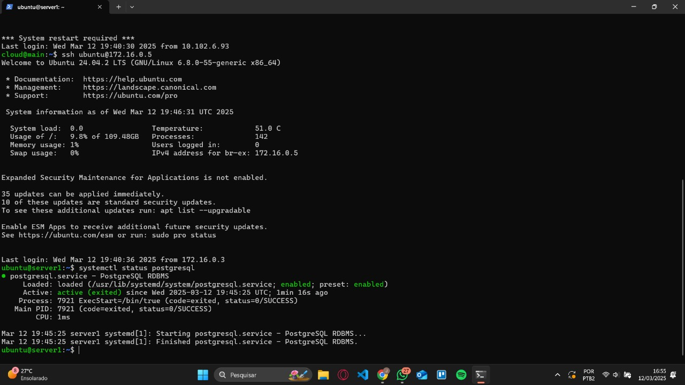
   /// caption 
   Imagem 1 - Verificação do status do PostgreSQL via systemctl. 
   ///

### 2\. Para garantir que o banco de dados está acessível na própria máquina, utilizamos:

   <!-- termynal -->
   ```bash
   telnet localhost 5432
   ifconfig
   ufw allow 5432/tcp
   journalctl -u postgresql
   ```

   - `telnet localhost 5432`: verifica se a porta está respondendo localmente
   - `ifconfig`: confirma o IP atribuído à interface de rede da máquina.
   - `ufw allow 5432/tcp`: identifica o IP da interface de rede.
   - `journalctl -u postgresql`: mostra os logs do serviço PostgreSQL.

   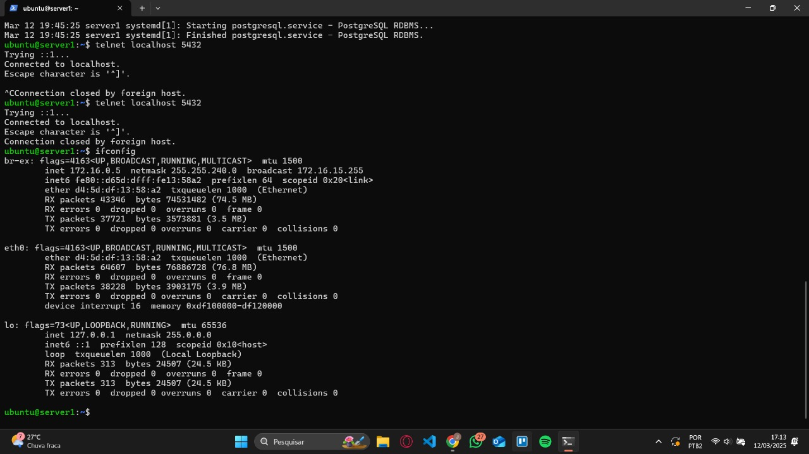
   /// caption 
   Imagem 2 - Teste de conexão local ao PostgreSQL.
   ///

### 3\. Para validar o acesso a partir da máquina MAIN:

   <!-- termynal -->
   ```bash
   telnet <ip-do-server1> 5432
   curl <ip-do-server1>:5432
   wget <ip-do-server1>:5432
   ```

   - `telnet <ip-do-server1> 5432`: verifica se é possível se conectar ao banco remotamente a partir de outra máquina.
   - `curl <ip-do-server1>:5432` ou `wget <ip-do-server1>:5432`: podem ser usados para verificar se há alguma resposta na porta TCP 5432, embora não sejam ideais para testar serviços PostgreSQL, pois esse protocolo não responde como HTTP.

   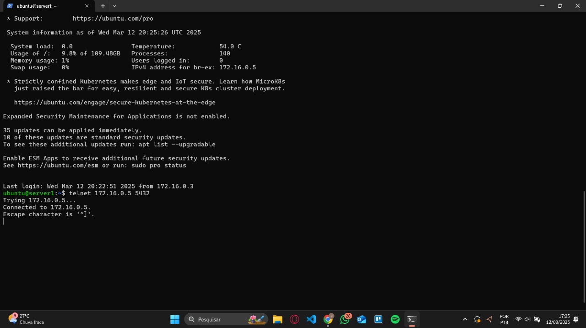
   /// caption 
   Imagem 3 - Teste de acesso remoto ao PostgreSQL.
   ///

### 4\. Por fim, para saber em qual porta o PostgreSQL está escutando:

   <!-- termynal -->
   ```bash
   ss -tlpn | grep postgres
   ```

   - `ss -tlpn | grep postgres`: mostra as portas TCP abertas, os processos escutando e confirma que o PostgreSQL está ouvindo na porta 5432.

   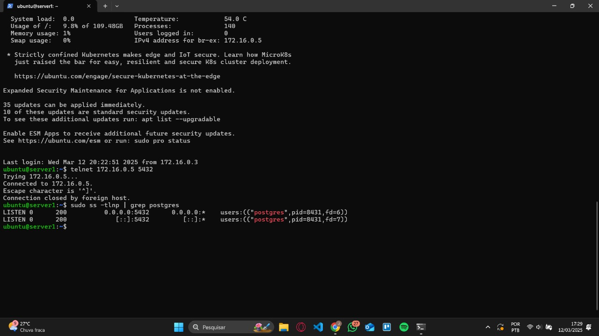
   /// caption 
   Imagem 4 - Verificação da porta utilizada pelo PostgreSQL.
   ///

---

## Tarefa 2 - Dashboard do MAAS e Testes nas Máquinas

Nesta etapa realizamos a verificação do ambiente no MAAS, observando as máquinas disponíveis, imagens sincronizadas e os testes de hardware realizados em cada máquina.


### 1. Visualização do Dashboard do MAAS.

Através da interface web do MAAS, é possível visualizar todas as máquinas provisionadas e seus respectivos IPs.

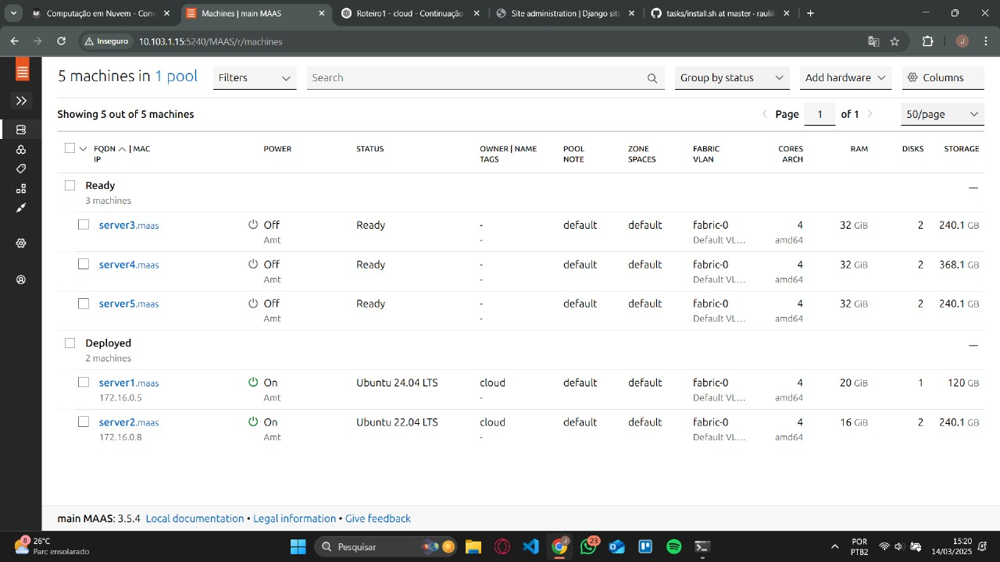
/// caption 
Imagem 5 - Dashboard do MAAS exibindo as máquinas configuradas.
///


### 2. Verificação das imagens disponíveis.

No MAAS, as imagens sincronizadas ficam disponíveis para deploy nas máquinas.

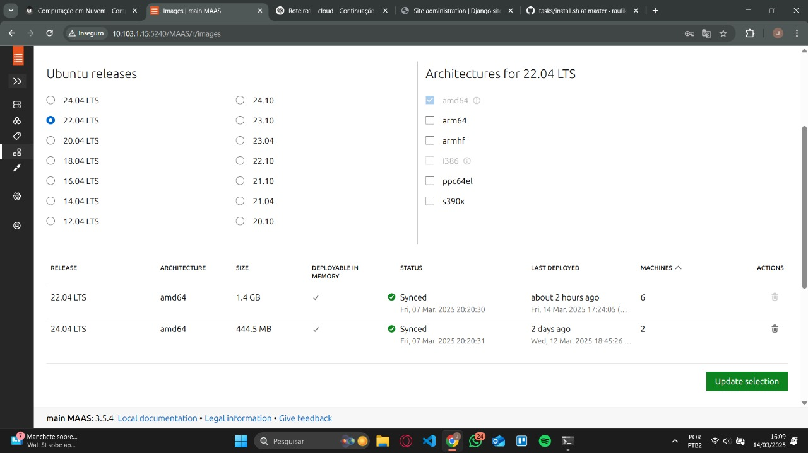
/// caption 
Imagem 6 - Imagens sincronizadas no MAAS.
///

### 3. Verificação dos testes de hardware (Commissioning) em cada máquina.

Em cada máquina do MAAS foram realizados testes de hardware para garantir que estão operando corretamente. O resultado desses testes pode ser visualizado individualmente.

Máquina `server1`:

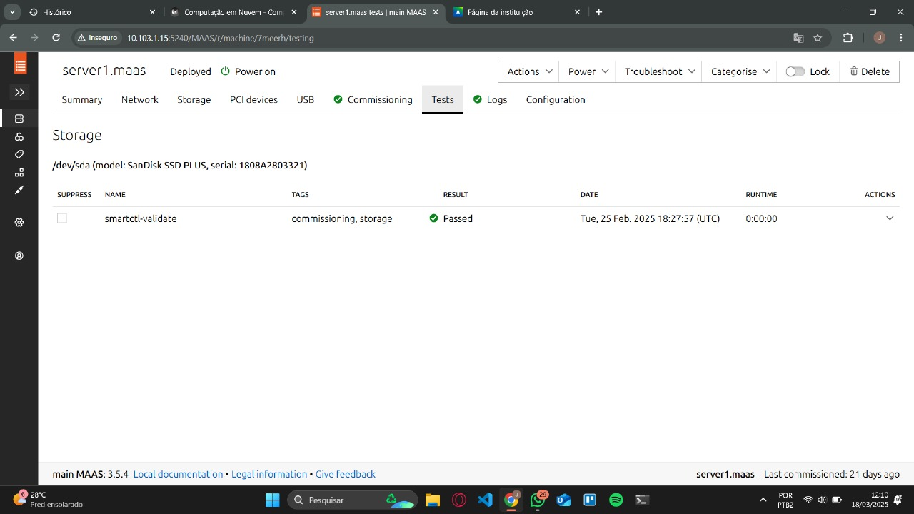
/// caption 
Imagem 7 - Testes de hardware com status OK na máquina server1.
///

Máquina `server2`:


/// caption 
Imagem 8 - Testes de hardware com status OK na máquina server2.
///

Máquina `server3`:

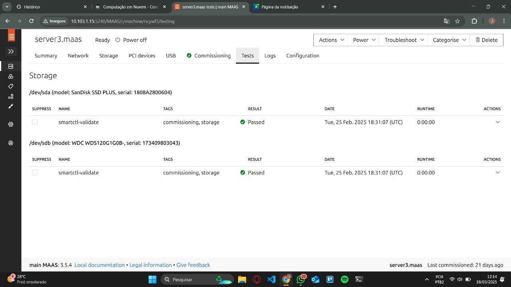
/// caption 
Imagem 9 - Testes de hardware com status OK na máquina server3.
///

Máquina `server4`:


/// caption 
Imagem 10 - Testes de hardware com status OK na máquina server4.
///

Máquina `server5`:


/// caption 
Imagem 11 - Testes de hardware com status OK na máquina server5.
///

---

## Tarefa 3 - Deploy Manual da Aplicação Django

Nesta tarefa foi realizado o deploy manual da aplicação Django em uma máquina `server2` provisionada no MAAS, utilizando o banco de dados PostgreSQL previamente instalado no `server1`.


### 1. Visualização do Dashboard do MAAS com as máquinas `server1` e `server2`.

No Dashboard do MAAS é possível visualizar as duas máquinas (`server1` e `server2`) ativas e com seus respectivos IPs atribuídos.

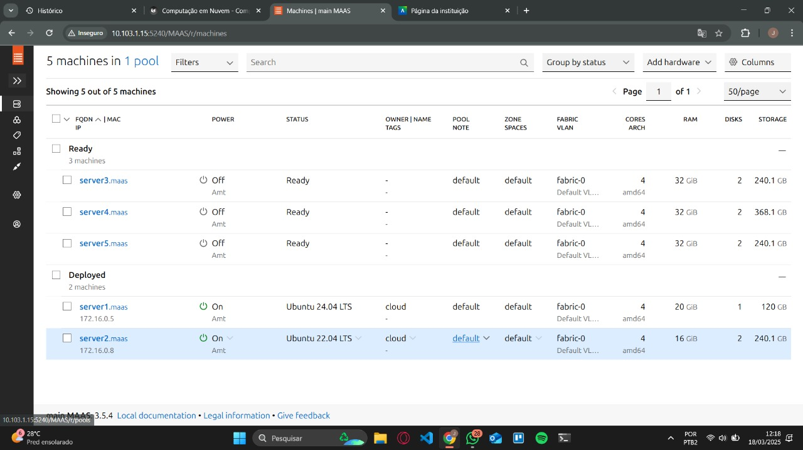
/// caption 
Imagem 12 - Dashboard do MAAS com as máquinas server1 e server2 configuradas.
///

### 2. Teste de acesso à aplicação Django no `server2`.

Após o deploy manual da aplicação, foi realizado o acesso ao Django Admin para comprovar o funcionamento correto da aplicação rodando no `server2`.

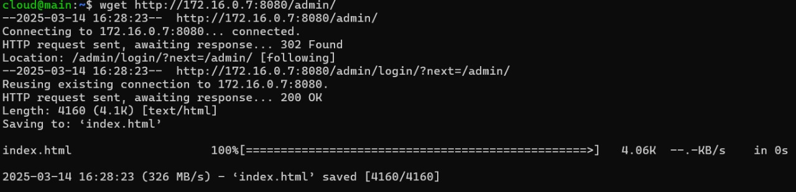
/// caption 
Imagem 13 - Acesso ao painel Django Admin da aplicação no server2.
///

### 3. Implementação manual da aplicação Django e banco de dados.

O processo de implementação manual foi realizado em duas etapas:

#### Banco de Dados (server1):

- Instalação do PostgreSQL.
- Criação do usuário `cloud` e do banco de dados `tasks`.
- Configuração dos arquivos `postgresql.conf` e `pg_hba.conf` para permitir conexões remotas.
- Liberação da porta 5432 no firewall.

#### Aplicação Django (server2):

- Provisionamento da máquina `server2` via MAAS.
- Clone do repositório da aplicação:

<!-- termynal -->
```bash
git clone https://github.com/raulikeda/tasks.git
```

- Execução do script de instalação:

<!-- termynal -->
```bash
cd tasks
./install.sh
reboot
```

- Criação de um túnel SSH para redirecionar a porta 8080 da aplicação para a máquina local:

<!-- termynal -->
```bash
ssh cloud@<ip-main> -L 8001:<ip-server2>:8080
```

- Acesso ao Django Admin pelo navegador através do endereço:

http://localhost:8001/admin/

---

## Tarefa 4 - Deploy Automatizado da Aplicação Django com Ansible

Nesta tarefa foi realizado o deploy automatizado da aplicação Django em uma nova máquina `server3`, utilizando a ferramenta Ansible. O objetivo foi demonstrar a diferença entre o deploy manual e o automatizado.


### 1. Visualização do Dashboard do MAAS com as máquinas `server1`, `server2` e `server3`.

No Dashboard do MAAS é possível visualizar as três máquinas ativas com seus respectivos IPs atribuídos.

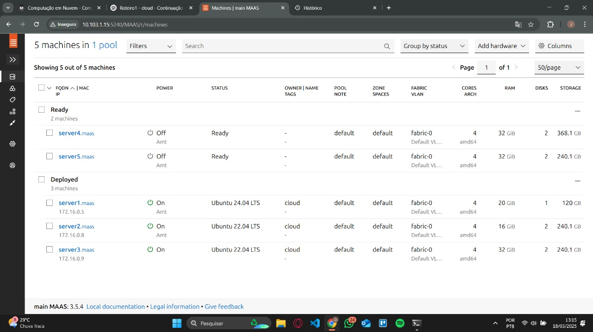
/// caption 
Imagem 14 - Dashboard do MAAS com as máquinas server1, server2 e server3 configuradas.
///


### 2. Teste de acesso à aplicação Django no `server2`.

Foi realizado o acesso ao Django Admin no `server2` para comprovar o funcionamento da aplicação após o deploy.

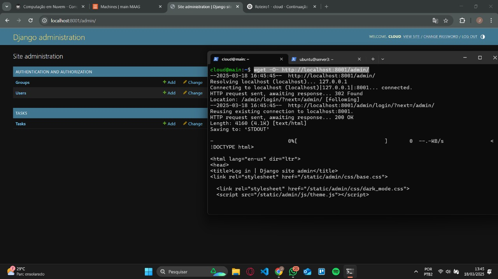
/// caption 
Imagem 15 - Acesso ao painel Django Admin da aplicação no server2.
///


### 3. Teste de acesso à aplicação Django no `server3`.

Após o deploy automatizado com Ansible, foi realizado o acesso ao Django Admin no `server3` para comprovar o funcionamento correto da aplicação.

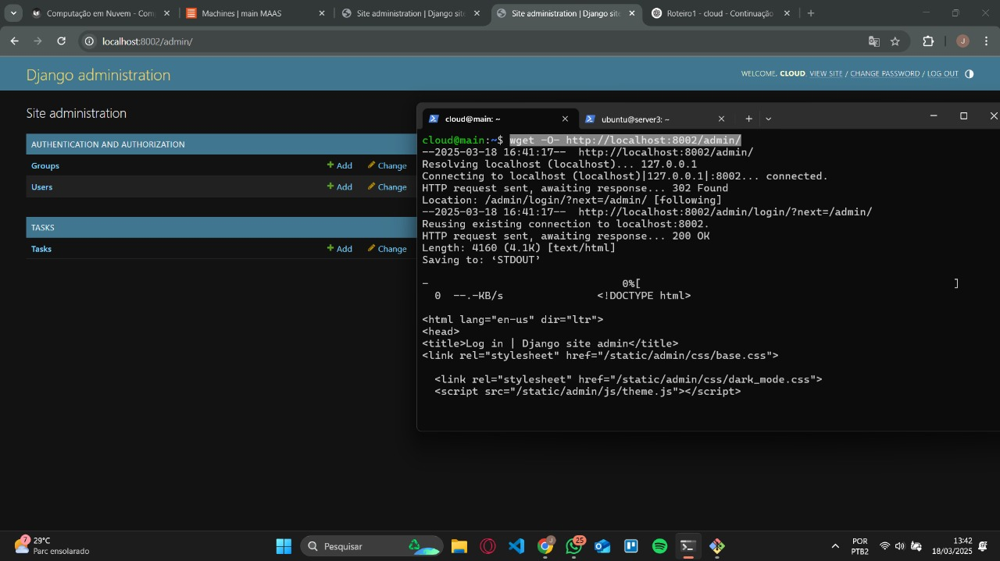
/// caption 
Imagem 16 - Acesso ao painel Django Admin da aplicação no server3.
///


### 4. Diferença entre instalar manualmente a aplicação Django e utilizando o Ansible.

A instalação manual da aplicação Django requer que todos os passos sejam realizados diretamente no terminal da máquina alvo. Isso inclui:

- Instalação de dependências.
- Clone do repositório da aplicação.
- Execução de scripts de instalação.
- Configurações manuais.

Esse processo é mais trabalhoso, demorado e sujeito a erros humanos, principalmente em ambientes com múltiplas máquinas.

Por outro lado, com o uso do Ansible o processo de instalação e configuração da aplicação é automatizado e padronizado. As principais vantagens do Ansible são:

- Execução remota e automatizada em diversas máquinas.
- Repetibilidade dos procedimentos (idempotência).
- Facilidade de manutenção e escalabilidade.
- Redução de erros manuais.

Dessa forma, o deploy com Ansible se mostra muito mais eficiente e prático para ambientes com múltiplos servidores.

---

## Tarefa 5 - Proxy Reverso com NGINX (Load Balancer)

Nesta tarefa foi realizada a configuração de um proxy reverso utilizando o NGINX na máquina `server4`. O objetivo foi criar um ponto único de acesso para a aplicação Django, realizando o balanceamento de carga entre `server2` e `server3`.


### 1. Visualização do Dashboard do MAAS com as máquinas `server1`, `server2`, `server3` e `server4`.

No Dashboard do MAAS é possível visualizar as quatro máquinas ativas e com seus respectivos IPs atribuídos.

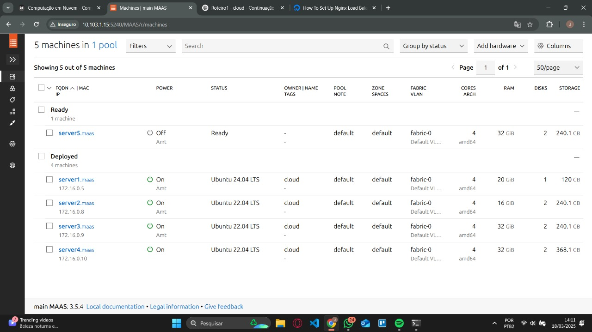
/// caption 
Imagem 17 - Dashboard do MAAS com as máquinas server1, server2, server3 e server4 configuradas.
///


### 2. Modificação do conteúdo da função `index` do arquivo `tasks/views.py`.

Foi alterada a mensagem da função `index` da aplicação Django em cada servidor (`server2` e `server3`) com o objetivo de identificar visualmente em qual servidor a requisição foi processada.

Exemplo do conteúdo do `views.py` em `server2`:

<!-- termynal -->
```bash
def index(request):
    return HttpResponse("Você está conectado ao server2")
```

Exemplo do conteúdo do `views.py` em `server3`:

<!-- termynal -->
```bash
def index(request):
    return HttpResponse("Você está conectado ao server3")
```

### 3. Teste de requisições GET via NGINX (Proxy Reverso).

Foi realizado um `GET request` no endereço do `server4` (Proxy Reverso) configurado com o NGINX para balancear o acesso entre os servers `server2` e `server3`.

A cada requisição, o NGINX direcionou a resposta de forma alternada, validando o funcionamento do balanceamento de carga.

Primeira requisição retornando resposta do `server2`:

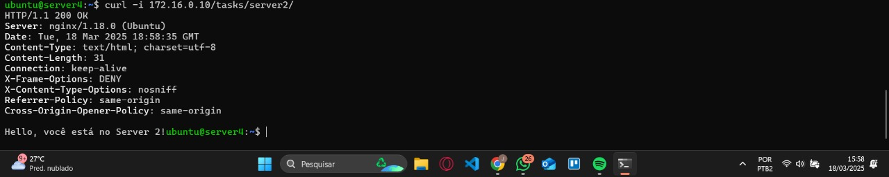
/// caption 
Imagem 18 - Resposta do Proxy Reverso redirecionando para o server2.
///

Segunda requisição retornando resposta do `server3`:

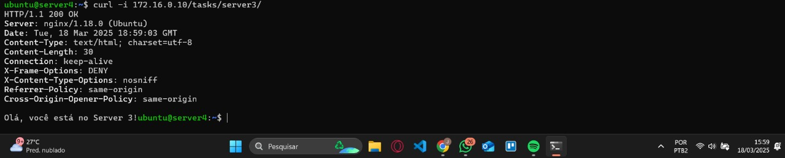
/// caption
Imagem 19 - Resposta do Proxy Reverso redirecionando para o server3.
///

---

## Discussões

Durante o desenvolvimento do roteiro, a parte mais difícil foi, sem dúvida, a configuração inicial do MAAS e o comissionamento das máquinas. Tivemos alguns problemas principalmente com a parte de rede, como o DHCP e o roteamento dos pacotes, o que exigiu bastante paciência, atenção aos detalhes e pesquisa na documentação.

Outro ponto que deu um pouco de trabalho foi a criação da bridge OVS nas máquinas, já que era preciso configurar tudo certinho para garantir que a comunicação entre os servidores funcionasse como esperado.

Por outro lado, a parte mais tranquila foi a instalação do PostgreSQL e da aplicação Django de forma manual, já que os passos eram bem claros e seguiam um padrão conhecido.

Já o deploy com Ansible foi algo novo e que trouxe um certo desafio no início, principalmente para entender a lógica dos playbooks e como o processo de automação funcionava. Mas depois que tudo ficou configurado corretamente, o Ansible se mostrou uma ferramenta muito prática e eficiente, facilitando bastante o deploy em múltiplos servidores.

---

## **Conclusão**
## Conclusão

## Conclusão

A realização deste roteiro foi essencial para colocar em prática tudo que aprendemos sobre infraestrutura bare-metal e o uso do MAAS. Foi um processo bem completo, que começou desde a instalação do sistema operacional Ubuntu até o deploy final da aplicação Django funcionando em um ambiente distribuído.

No começo, passamos por toda a parte de configuração da nuvem, preparando o MAAS, criando a bridge OVS e cadastrando os servidores. Essa etapa foi importante para garantir que tudo estivesse pronto e funcionando para os próximos passos.

Depois, fizemos o deploy manual do banco de dados PostgreSQL e da aplicação Django, o que ajudou bastante a entender melhor o funcionamento de cada parte da infraestrutura. Na sequência, usamos o Ansible para automatizar esse processo, o que deixou tudo muito mais rápido, fácil e padronizado.

Por fim, configuramos o NGINX como proxy reverso, criando um ponto único de acesso para a aplicação e implementando o balanceamento de carga entre os servidores, deixando o ambiente com uma cara mais próxima de produção.

No geral, o roteiro foi muito importante para ter uma visão prática e completa de como funciona o ciclo de vida de um ambiente em nuvem bare-metal, desde a sua criação até a entrega de uma aplicação funcionando de forma automatizada e eficiente.

---
