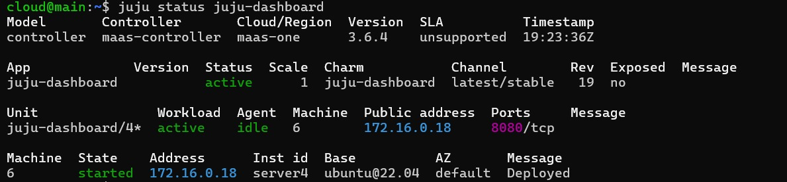

# Roteiro 2 - Deployment Orchestration com Juju

## Objetivos

Este roteiro teve como objetivo:

- Entender os conceitos básicos sobre uma plataforma de gerenciamento de aplicações distribuídas.
- Utilizar o Juju para orquestração de aplicações sobre infraestrutura Bare Metal.
- Realizar o deploy de aplicações utilizando charms do Juju.
- Integrar o Grafana com o Prometheus e validar o funcionamento.

---

## Infraestrutura Utilizada

Para este roteiro, utilizamos a infraestrutura provisionada previamente no MAAS (Bare Metal), com as seguintes máquinas disponíveis:

- server1
- server2
- server3
- server4
- server5

Antes de iniciar o deploy, verificamos se todas as máquinas estavam com status *Ready* no MAAS. Caso alguma máquina estivesse alocada, foi realizado o *release*.

---

## Instalação do Juju

A instalação do Juju foi feita na máquina *main* via SSH.

<!-- bloco de código -->
$ sudo snap install juju --channel 3.6

---

## Deploy do Dashboard do Juju

O Dashboard do Juju foi instalado conforme documentação oficial.

<!-- bloco de código -->
$ juju dashboard

Após a instalação, o Dashboard foi acessado via navegador no endereço:

http://IP-da-main:17070/

---

## Deploy do Grafana e Prometheus

Foi criada a pasta *charms* e feito o download dos charms do *charmhub*.

<!-- bloco de código -->
$ mkdir -p /home/cloud/charms
$ cd /home/cloud/charms
$ juju download grafana
$ juju download prometheus2

Em seguida, realizamos o deploy dos charms baixados.

<!-- bloco de código -->
$ juju deploy ./prometheus2_*.charm
$ juju deploy ./grafana_*.charm

Para acompanhar o deploy:

<!-- bloco de código -->
$ watch -n 1 juju status

---

## Integração Grafana com Prometheus

A integração foi realizada via Juju, utilizando a funcionalidade *integrate*.

<!-- bloco de código -->
$ juju integrate grafana prometheus2

Após isso, o Dashboard do Grafana foi acessado via navegador. Foi criada uma visualização com o Prometheus como *source*.

---

## Evidências

### 1 - Dashboard do MAAS com máquinas e IPs

/// caption
Imagem 1 - Dashboard MAAS
///

---

### 2 - Status do Juju após deploy do Grafana

/// caption
Imagem 2 - Juju Status
///

---

