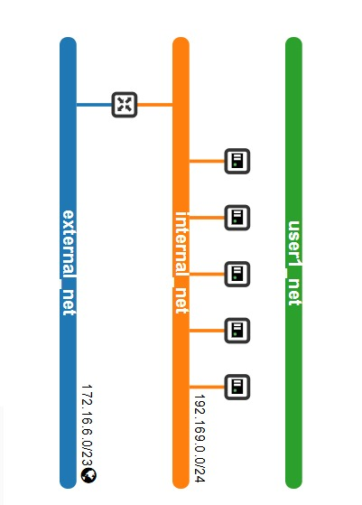

# Roteiro 3 - OpenStack

## Setup

### Autenticação e Dashboard
- Arquivo `openrc` criado com as credenciais de acesso ao OpenStack.
- Acesso ao Horizon realizado com sucesso via `admin_domain`.
- Dashboard mantido aberto durante toda a configuração.

### Tarefa 1

#### Status do Juju
  
/// caption 
Status do ambiente Juju após bootstrap e deploy.
///

#### Dashboard do MAAS com as máquinas
  
/// caption 
Exibição das máquinas disponíveis no ambiente MAAS.
///

#### Aba Compute Overview no OpenStack
  
/// caption 
Visão geral de uso de recursos computacionais no OpenStack.
/// 

#### Aba Compute Instances no OpenStack
  
/// caption 
Instâncias criadas até o momento via Horizon.
/// 

#### Topologia da Rede
  
/// caption 
Conexões entre redes interna, externa e instâncias.
///

### Imagens e Flavors
- Cliente OpenStack instalado via Snap.
- Credenciais carregadas com `source openrc`.
- Serviços verificados com `openstack service list`.
- Ajustes na rede:
  ```bash
  juju config neutron-api enable-ml2-dns="true"
  juju config neutron-api-plugin-ovn dns-servers="172.16.0.1"
  ```
- Imagem Ubuntu Jammy importada no Glance.
- Flavors criados:
  ```
  m1.tiny    1 vCPU   1 GB RAM   20 GB Disk
  m1.small   1 vCPU   2 GB RAM   20 GB Disk
  m1.medium  2 vCPU   4 GB RAM   20 GB Disk
  m1.large   4 vCPU   8 GB RAM   20 GB Disk
  ```

### Rede Externa
- Faixa: `172.16.7.0/23`
- Criada rede externa `external_net`.

### Rede Interna e Roteador
- Subnet: `192.169.0.0/24`
- Criada rede interna `internal_net`.
- Roteador conectado à rede externa.

### Conexão
- Par de chaves importado com `id_rsa.pub` da máquina main.
- Grupo de segurança atualizado com SSH e ICMP liberados.
- Topologia da rede validada conforme projeto da infraestrutura.

### Instância Inicial
- Instância `client` disparada com flavor `m1.tiny`, sem volume.
- IP flutuante alocado e conectado com sucesso via SSH.

### Tarefa 2

#### Dashboard do MAAS atualizado
  
/// caption 
Estado atualizado do MAAS após alocação de novas máquinas.
///

#### Compute Overview com novas instâncias
  
/// caption 
Visão geral do uso de recursos após escalonamento de instâncias.
///

#### Compute Instances atualizada
 
/// caption  
Lista de todas as instâncias em execução com seus IPs e status.
///

#### Topologia de rede atualizada
  
/// caption 
Atualização da topologia após criação de múltiplas instâncias.
///

#### Diferenças entre Tarefa 1 e Tarefa 2
- Tarefa 2 inclui instâncias `db`, `api1`, `api2` e `lb`.
- Alocação de máquinas novas (nodes 3 e 4).
- Rede apresenta mais conexões na topologia.

#### Como os recursos foram criados
- Instâncias criadas via Horizon, com flavors definidos.
- IPs internos e flutuantes alocados automaticamente.
- Atribuição automática dos hosts visível no detalhe das instâncias.

## Escalando os Nós

- Verificação de máquina `ALLOCATED` no MAAS para adicionar ao cluster.
- Comandos:
  ```bash
  juju add-unit nova-compute
  juju add-unit --to <machine-id> ceph-osd
  ```
- Nova máquina adicionada como nó de cálculo e armazenamento.

## App

### Tarefa 3

#### Arquitetura da Rede
 
/// caption  
 Arquitetura de rede com instâncias conectadas à internal_net, roteador e external_net, com IP flutuante em lb (NGINX).
///

- Rede `192.169.0.0/24`: interna
- Rede `172.16.0.0/20`: externa (alocação de floating IPs)
- Instâncias:
  - `client`
  - `lb` (load balancer NGINX)
  - `api1` e `api2`
  - `db`

### Tarefa 4

#### Execução do FastAPI
 
/// caption  
Lista final de instâncias rodando a aplicação.
///

#### Alocação de Instâncias
  
/// caption
Instância `db` alocada no host físico `node4.maas`.
///

  
/// caption 
Instância `api1` alocada no host físico `node3.maas`.
/// 

  
/// caption 
Instância `api2` alocada no host físico `node4.maas`.
///

  
/// caption
Instância `lb` alocada no host físico `node5.maas`.
///

#### Topologia
 
/// caption  
Representação das redes `external_net`, `internal_net` e `user_net`.
///

  
/// caption 
Diagrama gráfico da infraestrutura conectada ao gateway e VMs.
///

#### Visão Geral
  
/// caption 
Painel de uso de recursos computacionais e de rede no Horizon.
///