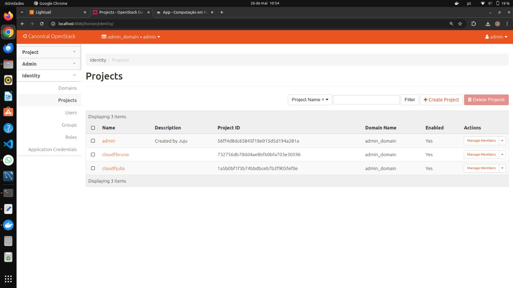
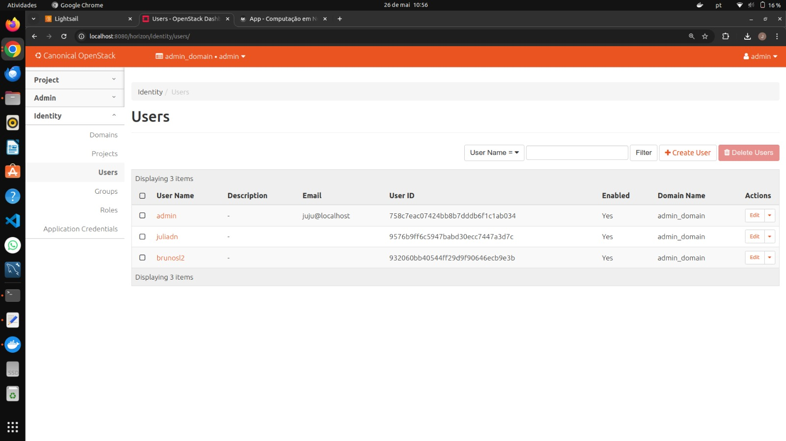
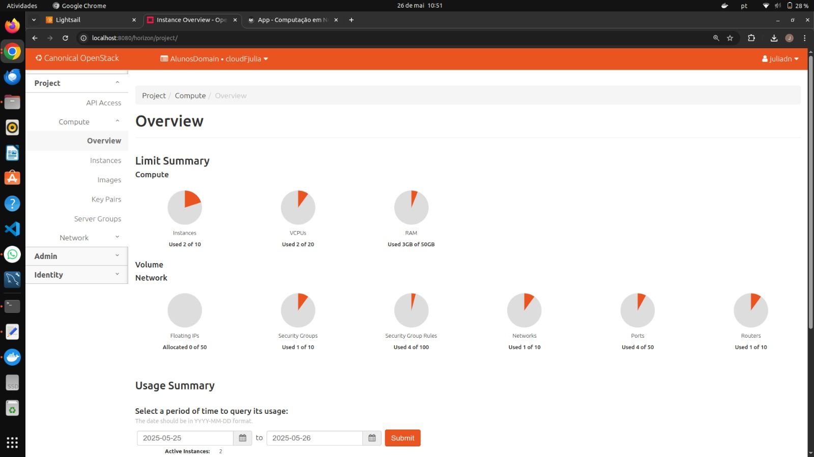
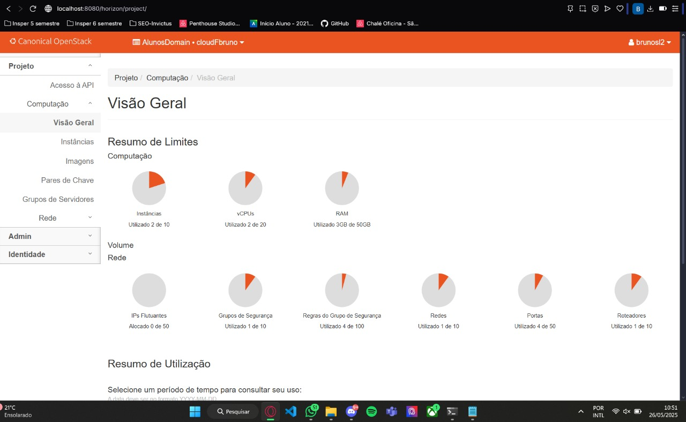
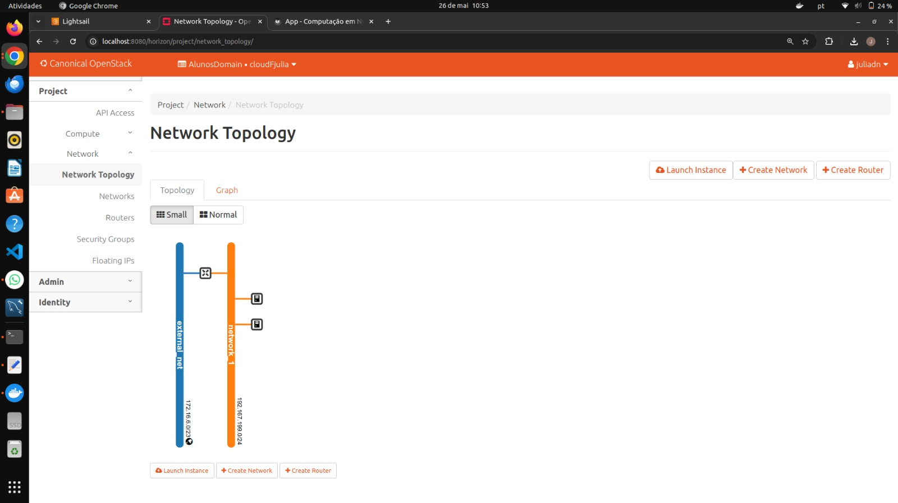
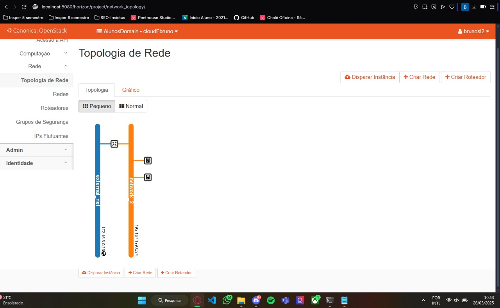

# Roteiro 4 - SLA, DR e IaC
## CheckPoint - Por Aluno

### Tarefa 1 - Validação do OpenStack

Para validar a configuração do OpenStack, foram capturadas as seguintes telas do dashboard:

#### Identity Projects

#### Identity Users  

#### Compute Overview 

1\. Julia

2\. Bruno

#### Topologia de Rede

1\. Julia

2\. Bruno

Estas telas demonstram a configuração correta dos recursos do OpenStack, incluindo:
- Projetos e usuários configurados
- Visão geral dos recursos computacionais
- Topologia da rede configurada

### Tarefa 2 - Análise de Cloud e DevOps

#### Questão (a) - Escolha entre Public Cloud e Private Cloud

**Resposta:**

Nós escolheriamos a Private Cloud, porque o sistema trabalha com dados confidenciais e teriamos mais segurança, garantindo que tudo esteja em conformidade com a LGPD, por exemplo.

Já a Public Cloud pode até ter um custo inicial menor, mas a Private permite personalizar e isolar a rede, o que é essencial para proteger o ambiente operacional da empresa. Não deixando a segurança em segundo plano.

#### Questão (b) - Justificativa para Time de DevOps

**Resposta:**

Um time DevOps é essencial para garantir agilidade e confiabilidade na entrega.

1\. Reduzir Custos:
    DevOps elimina trabalho manual repetitivo
    Menos falhas = menos hora consertando erros

2\. Entregas mais rápidas:
    Atualizações em minutos
    Ex: se a empresa faz 1 deploy por mês.

3\. Atrai melhores talentos:
    Engenheiros bons querem trabalhar com tecnologias boas. 

#### Questão (c) - Plano de DR e HA

**Resposta:**

As maiores ameaças pro nosso sistema seriam falha de hardware, ataques cibernéticos (tipo ransomware) e erro humano (alguém apagando algo sem querer, por exemplo). A gente precisa ter backup automático, criptografado, e armazenado em mais de um lugar (tipo diferentes regiões). Também vamos monitorar tudo o tempo todo e, se algo cair, um outro servidor assume automaticamente (failover). A alta disponibilidade vai ser feita com containers orquestrados, balanceador de carga e várias instâncias rodando ao mesmo tempo pra não deixar o sistema fora do ar.

